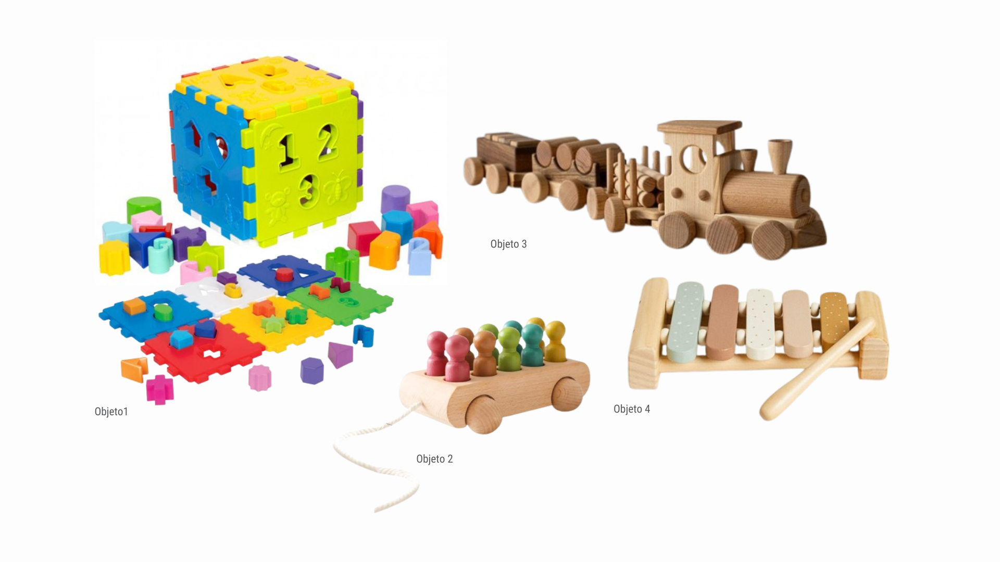
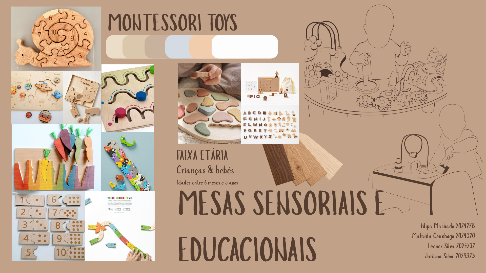

# Contexto de Design

Página explicativa do contexto, em concordância com a apresentação produzida em grupo. Componente de **grupo**.

## 1. Resumo / Abstract

### Resumo (PT)

O presente trabalho integra uma coleção de brinquedos educativos inspirados na metodologia Montessori, uma abordagem pedagógica que coloca a criança no centro do processo de aprendizagem e valoriza a exploração livre, a autonomia e a descoberta através da experiência. 
A coleção é composta por 4 produtos distintos: um xilofone educativo, um comboio das vogais, um cubo e puzzle de números e um comboio sensorial com o nome de Ninho de família.
Cada brinquedo foi concebido para estimular diferentes competências do desenvolvimento infantil mantendo uma linguagem comum e na valorização da interação direta da criança com o objeto. 

**O xilofone** promove a exploração musical, a coordenação motora e a perceção auditiva, **o comboio das vogais** incentiva a aprendizagem das letras e dos sons da linguagem de uma forma interativa, **o cubo de encaixes** permite trabalhar a coordenação motora e o reconhecimento de números e letras, e por sua vez, **o comboio de encaixes sensoriais** estimula a exploração tátil e o reconhecimento de diferentes formas e elementos.

Inspirados pelos princípios Montessori, todos os produtos foram pensados para incentivar a autonomia, a criatividade e a aprendizagem ao ritmo de cada criança. Mais do que simples brinquedos, estes objetos constituem ferramentas educativas que promovem a curiosidade, a experimentação e a construção ativa do conhecimento, transformando o brincar numa experiência rica e significativa para o desenvolvimento infantil.

### Abstract (EN)

This work integrates a collection of educational toys inspired by the Montessori methodology, a pedagogical approach that places the child at the center of the learning process and values ​​free exploration, autonomy, and discovery through experience.
The collection consists of 4 distinct products: an educational xylophone, a vowel train, a number cube and puzzle, and a sensory train called Family Nest.
Each toy was designed to stimulate different skills in child development while maintaining a common language and valuing the child's direct interaction with the object.

**The xylophone** promotes musical exploration, motor coordination, and auditory perception; **the vowel train** encourages learning letters and sounds of language in an interactive way; **the number cube** allows working on motor coordination and the recognition of numbers and letters; and, in turn, **the sensory train** stimulates tactile exploration and the recognition of different shapes and elements.

Inspired by Montessori principles, all products were designed to encourage autonomy, creativity, and learning at each child's own pace. More than just toys, these objects are educational tools that promote curiosity, experimentation, and the active construction of knowledge, transforming play into a rich and meaningful experience for child development.

## 2. Referências Coletivas

### 2.1. Recolha de Objetos a Redesenhar/Remisturar

Catálogo de objetos de partida que o grupo identificou para o redesenho. Para cada objeto: imagem, origem, motivo da escolha.

> - **Objeto 1** — utilizado como base para o desenvolvimento do cubo, este brinquedo serviu como referência durante o processo de desenvolvimento do projeto, pela forma como combina números, formas geométricas e sistemas de encaixe. A sua análise contribuiu para a exploração de soluções construtivas e para a reflexão sobre a utilização da madeira como material mais sensorial, seguro e adequado ao público infantil.
> - **Objeto 2** — foi utilizado como base Para criar o Ninho das Famílias, juntei a ideia dos brinquedos de associação com os tradicionais carrinhos de puxar em madeira. Quis criar um brinquedo que permitisse às crianças explorar, transportar e criar pequenas histórias enquanto associam cada imagem à sua respetiva família.
> - **Objeto 3** — serviu de inspiração para o desenvolvimento do comboio das vogais, tendo sido escolhida pela sua estética simples em madeira, pelas formas arredondadas e pela composição das diferentes carruagens interligadas.
> - **Objeto 4** — foi utilizada como base para o desenvolvimento do xilofone, tendo sido escolhida pela sua estética simples e apelativa, pelas formas arredondadas das barras e pela estrutura de suporte em madeira.

### 2.2. Moodboard

Painel de referências visuais e conceptuais que orientam a estratégia do grupo.

