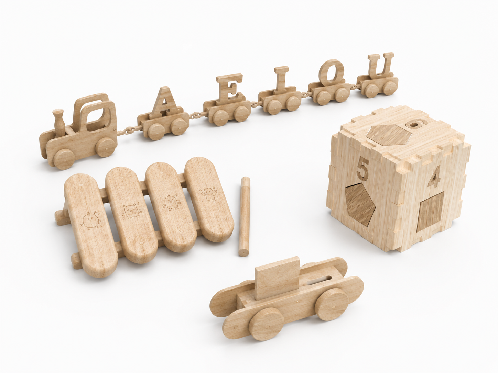

# Montessori

> Através da metodologia Montessori, desenvolvemos experiências lúdicas que promovem a autonomia, a criatividade e a descoberta.

## Elementos do Grupo

| Número   | Nome             |
| -------- | ---------------- |
| 20024320 | Mafalda Counhago |
| 2024292  | Leonor Silva     |
| 2024323  | Juliana Silva    |
| 2024378  | Filipa Machado   |

---

## Contexto de Design

> _Imagem gerada por Inteligência Artificial (Chatgpt)_

> Esta coleção nasce da convicção de que brincar é uma forma essencial de aprender. Inspirados pela metodologia Montessori, os diferentes brinquedos incentivam a exploração livre, a manipulação de materiais concretos e a descoberta ativa, permitindo que cada criança construa o conhecimento através da experiência.
> 
> Apesar dos seus diferentes temas , todos os produtos partilham a mesma intenção, despertar a curiosidade, promover a autonomia e acompanhar o desenvolvimento infantil de forma natural e progressiva. Mais do que oferecer respostas, estas brincadeiras propõem desafios, estimulam a criatividade e convidam as crianças a experimentar, errar, repetir e descobrir ao seu próprio ritmo.

Resumo, referências coletivas e moodboard do grupo encontram-se em [contexto.md](contexto.md).

[Ver contexto completo →](contexto.md)

---

## Galeria de Produtos

<!-- Cada thumbnail liga à página individual de cada produto.
     Cada produto vive em produtos/<numero>-<nome>/index.md
     e tem uma sub-página produtos/<numero>-<nome>/processo.md -->

<!-- markdownlint-disable MD033 -->

  <!-- duplicar o bloco abaixo para cada produto do grupo -->

  <a class="gallery-card" href="produtos/Xilofone Aprende e Toca/">
    
    <h3>Xilofone Aprende e Toca</h3>
    
Mafalda Counhago

  </a>
<a class="gallery-card" href="produtos/Comboio das Vogais/">
    
    <h3>Comboio das Vogais</h3>
    
Juliana Silva

  </a>
<a class="gallery-card" href="produtos/Ninho da Família/">
    
    <h3>Ninho da Família</h3>
    
Filipa Machado

  </a>
  <a class="gallery-card" href="produtos/Cubo e Puzzle de números e formas/">
    
    <h3>Cubo e Puzzle de números e formas</h3>
    
Leonor Silva

  </a>
  <!-- duplicar o bloco acima para cada produto do grupo  e substituir _modelo em ambas por <numero>-<nome> -->

