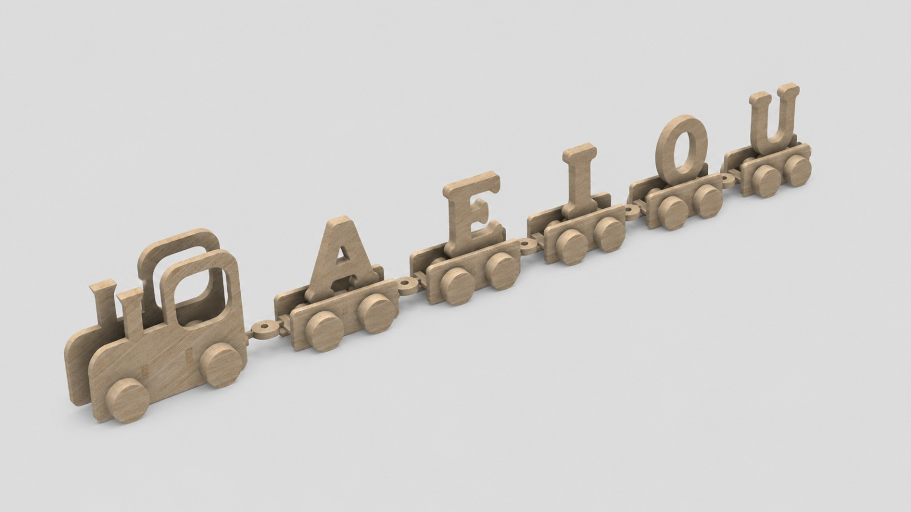
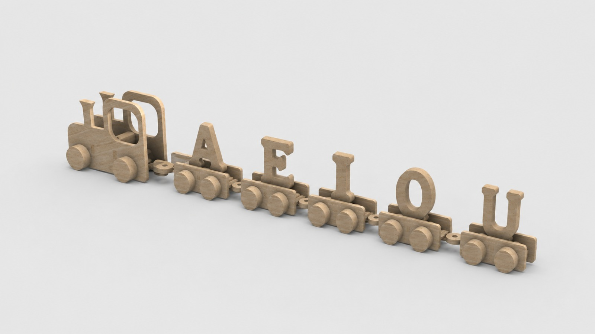

# Comboio das vogais

<!--
  HERO: idealmente uma pseudo-sessão fotográfica do produto
  (ver tutorial Pletor.ai nos Recursos da disciplina, em
  /Recursos/AI_exps/). Usa attachments/hero.jpg para o frontmatter.
-->

> Letras que despertam imaginação.

## Conceito

O comboio de vogais é um brinquedo educativo em madeira que procura introduzir as crianças ao reconhecimento e à sequência das vogais através de uma experiência simples e lúdica. Constituído por uma locomotiva e cinco carruagens identificadas com as vogais, o brinquedo desafia a criança a organizá-las pela ordem correta, podendo depois ser utilizado como um comboio convencional, incentivando o brincar livre e imaginativo.

Pensado para crianças em idade pré-escolar, o objeto acompanha uma fase importante do desenvolvimento linguístico, em que a aprendizagem das primeiras letras começa a ganhar significado. A manipulação das peças contribui também para o desenvolvimento da coordenação motora, da perceção visual e da capacidade de associação.

Este projeto nasce da ideia de tornar o processo de aprendizagem das vogais mais dinâmico e apelativo, afastando-se de métodos exclusivamente teóricos e proporcionando um contacto direto com as letras através do jogo. Ao combinar uma componente educativa com uma função de entretenimento, o brinquedo transforma a aprendizagem num momento de descoberta e diversão.

>**Renderização Fusion 360**
## Enquadramento

O presente projeto insere-se no universo dos brinquedos educativos baseados na metodologia Montessori, onde a aprendizagem ocorre através da exploração autónoma, da experimentação e da interação direta com o objeto. Neste contexto, o brinquedo é pensado como uma ferramenta que acompanha o ritmo da criança, permitindo-lhe descobrir e consolidar conhecimentos através da experiência prática.

A partir da análise de diferentes referências e brinquedos educativos, foram identificadas características como a simplicidade formal, a manipulação de elementos independentes e a associação entre objetos e conceitos de aprendizagem. Estes aspetos orientaram o desenvolvimento do comboio de vogais, uma proposta que relaciona o reconhecimento e a ordenação das letras com uma experiência lúdica, promovendo simultaneamente a autonomia, a curiosidade e o desenvolvimento de competências cognitivas e motoras.

Posicionamento em relação ao contexto de grupo (ver [contexto](../../contexto.md)) e à recolha de objetos a redesenhar.

## Tecnologia

O brinquedo foi concebido em madeira de carvalho, material escolhido pela sua resistência, durabilidade e pelas suas características naturais, proporcionando um objeto robusto e adequado à utilização infantil. A opção por utilizar apenas o acabamento natural da madeira valoriza a sua textura e simplicidade formal, em concordância com os princípios dos brinquedos educativos inspirados na metodologia Montessori.
A estrutura do comboio, incluindo a locomotiva, as carruagens e as vogais integradas em cada uma delas, foi projetada para ser produzida através de corte CNC em placas de madeira com espessuras compreendidas entre os 10 mm e os 15 mm. As ligações entre as carruagens são realizadas através de encaixes de madeira, permitindo a montagem e reorganização das peças de forma simples e intuitiva.
O desenvolvimento técnico foi realizado no Autodesk Fusion 360, recorrendo à modelação paramétrica para definir as geometrias, ajustar as dimensões das peças, garantir o correto funcionamento dos encaixes e testar virtualmente a composição do produto. Foram ainda considerados aspetos ergonómicos, como a inclusão de cantos arredondados e dimensões adequadas ao manuseamento por crianças, assegurando uma experiência de utilização confortável e apropriada ao público-alvo.

- Modelo 3D: 
  https://a360.co/4etTpsN

## Função

O comboio de vogais apresenta uma função educativa centrada na introdução às primeiras letras e no reconhecimento da sequência correta das vogais. Através da manipulação das carruagens e da sua organização, o brinquedo estimula a memória, a associação visual, a coordenação motora fina e o desenvolvimento das competências linguísticas iniciais, conciliando a aprendizagem com a brincadeira livre.

**Como se brinca?** O brinquedo pode ser explorado de duas formas principais:

**Sequência das vogais** – A criança deve identificar cada vogal e organizar as carruagens pela ordem correta (A, E, I, O, U), formando o comboio completo. Esta atividade promove o reconhecimento das letras, a memorização da sua sequência e a capacidade de associação.

**Brincadeira livre** – Depois de concluída a sequência, o comboio pode ser utilizado como um brinquedo tradicional, permitindo à criança deslocá-lo, criar narrativas e explorar diferentes situações imaginárias, incentivando a criatividade e o jogo simbólico.

**Idade-alvo** – O brinquedo destina-se a crianças com idade igual ou superior a 5 anos, período em que o contacto com as letras, a linguagem e a manipulação de objetos educativos assume um papel importante no seu desenvolvimento.

**Montagem** – O brinquedo é composto por uma locomotiva e cinco carruagens independentes, ligadas através de um sistema de encaixe em madeira. A sua montagem é simples e intuitiva, permitindo que a própria criança una as peças e reorganize as carruagens sempre que desejar.

**Conformidade com a Diretiva 2009/48/CE** – No desenvolvimento do produto foram considerados os princípios gerais estabelecidos na Diretiva 2009/48/CE relativa à segurança dos brinquedos. A escolha da madeira de carvalho, a presença de cantos arredondados, a ausência de arestas cortantes e a definição de dimensões adequadas à utilização infantil contribuem para uma experiência de utilização segura e apropriada ao público-alvo.

## Apresentação

Imagens-chave que sintetizam o produto final.

## Processo

O percurso completo de iterações, modelos e pesquisa está em [processo.md](processo.md), organizado do **mais recente** para o **mais antigo**.

[Ver processo completo →](processo.md)
