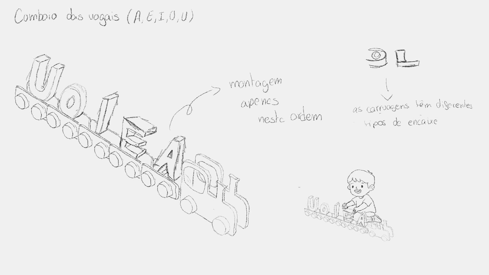
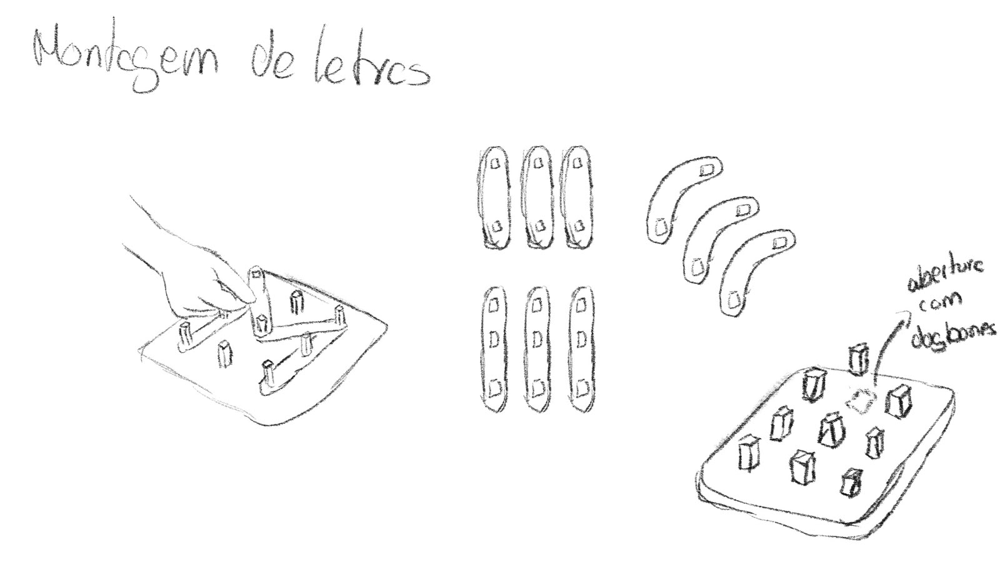
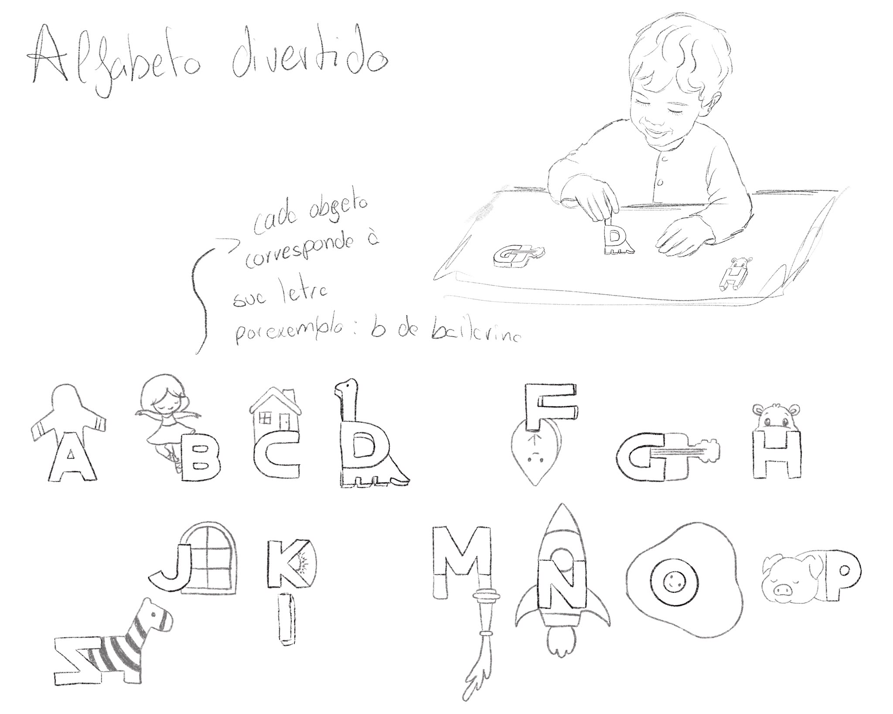
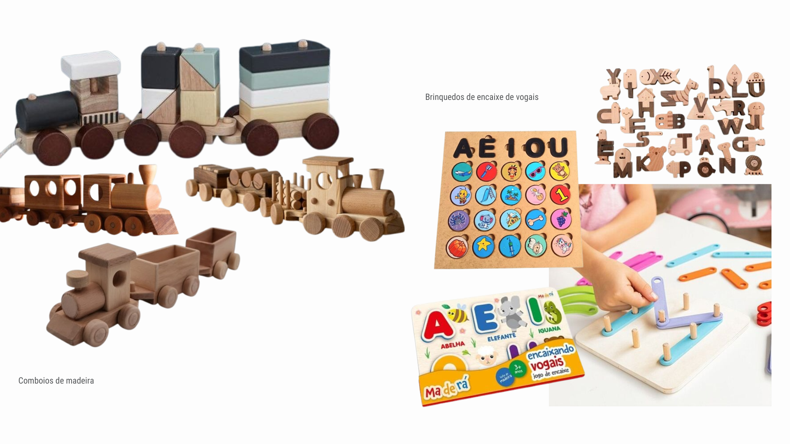

# Processo

## 1. Modelos 3D

Embed do Fusion (visualização do modelo paramétrico).

https://a360.co/4nqYoPa

## 2. Esboços e Pranchas-Resumo

> **Prancha resumo final** - Esta versão apresenta a solução final desenvolvida para o projeto, resultante da simplificação e reformulação das propostas anteriores. Após uma análise das possibilidades de interação e da viabilidade construtiva, optou-se pela criação de um comboio composto apenas pelas vogais, proporcionando uma abordagem lúdica e educativa adequada à fase inicial de aprendizagem das letras.

> **Segunda proposta de desenvolvimento** - Nesta fase foi explorada uma proposta baseada num jogo de encaixe, constituído por uma base com pinos e por diferentes peças que permitiam a formação das letras do alfabeto. Apesar de representar uma melhoria relativamente à proposta inicial, verificou-se que a dinâmica do objeto poderia ser mais apelativa e interativa, levando à procura de uma solução que combinasse melhor a aprendizagem com a brincadeira.

> **Primeira proposta conceptual** - A proposta inicial consistia na criação de um alfabeto em que cada letra estaria associada a um elemento visual correspondente a um objeto ou animal iniciado pela mesma. Contudo, após uma análise mais aprofundada, verificou-se que a solução apresentava limitações ao nível da produção em CNC e não explorava adequadamente mecanismos de encaixe ou interação física. Esta constatação conduziu à reformulação do conceito e à procura de alternativas mais adequadas aos objetivos do projeto.

## 3. Pesquisa

### 3.1. Aspectos valorizados do moodboard, desconstrução da forma (o que distingue o programa formal)

> As referências selecionadas no moodboard evidenciam uma linguagem visual baseada na utilização da madeira, em formas simples e em brinquedos educativos que promovem a aprendizagem através da interação. A análise destas referências permitiu identificar características como a simplicidade das formas, a manipulação ativa e a associação entre brincar e aprender. Estes elementos foram reinterpretados no desenvolvimento do comboio das vogais, um brinquedo que combina a exploração das letras com uma experiência lúdica de descoberta e construção.
### 3.2. Objetos de referencia

Inventário de precedentes, brinquedos análogos, referências históricas.

>**Comboios de madeira** – A estrutura modular do comboio e a utilização de formas simples em madeira inspiraram o desenvolvimento da solução final, evidenciando a componente lúdica, a ligação entre as diferentes peças e a facilidade de manipulação por parte da criança. 
  **Brinquedos de encaixe de vogais** – A aprendizagem das vogais através da manipulação direta das peças influenciou a criação de uma experiência educativa baseada na exploração, no reconhecimento das letras e na associação entre brincar e aprender.

