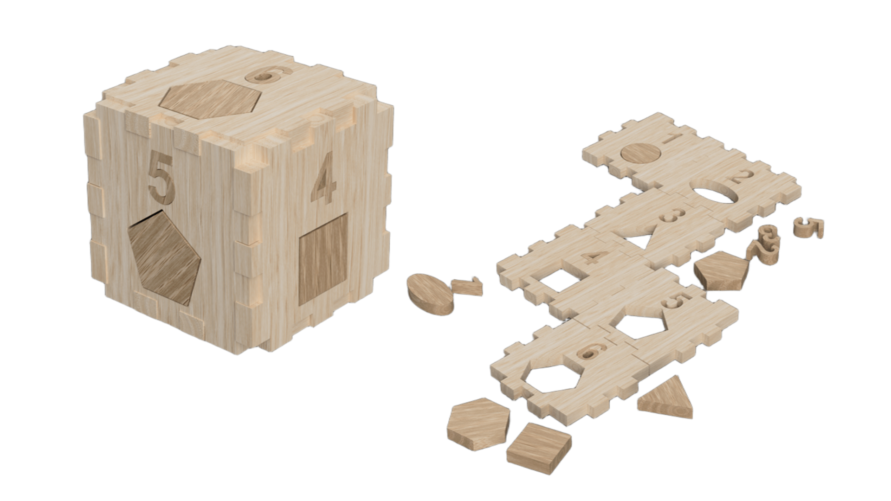
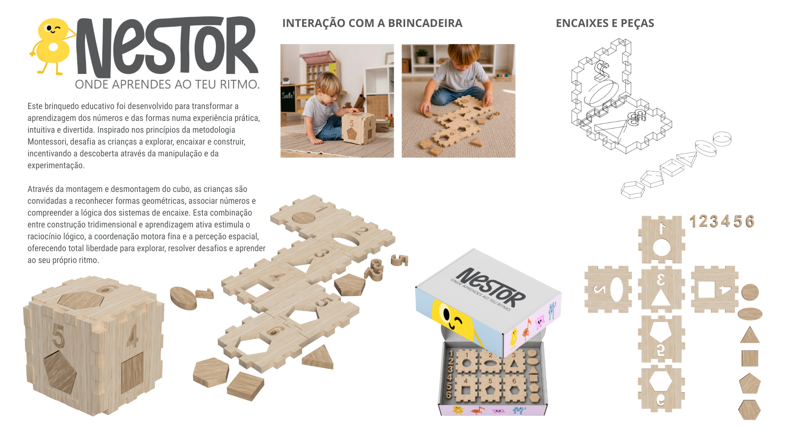

# Cubo e Puzzle de números e formas

<!--
  HERO: idealmente uma pseudo-sessão fotográfica do produto
  (ver tutorial Pletor.ai nos Recursos da disciplina, em
  /Recursos/AI_exps/). Usa attachments/hero.jpg para o frontmatter.
-->

> Conta, encaixa e descobre.

## Conceito

Este projeto consiste num brinquedo educativo em madeira que combina números, formas geométricas e construção num único objeto. Através de um sistema de encaixe, as peças podem ser montadas para formar um cubo e posteriormente reorganizadas como um Puzzle, proporcionando diferentes formas de interação e aprendizagem.
Destina-se a crianças em idade pré-escolar, numa fase em que o desenvolvimento da motricidade fina, do raciocínio lógico e do reconhecimento numérico assume um papel fundamental. Inspirado nos princípios Montessori, o brinquedo respeita o ritmo individual de cada criança, incentivando a exploração autónoma e a descoberta através da experiência prática.
A proposta surge da intenção de transformar a aprendizagem dos números numa atividade lúdica e envolvente. Mais do que ensinar conceitos matemáticos básicos, pretende estimular a curiosidade, a criatividade e a capacidade de resolução de problemas, promovendo uma aprendizagem ativa através do brincar.

>**Renderização (Fusion 360)**: Exemplo das duas Brincadeiras possíveis.
## Enquadramento

O presente projeto insere-se no contexto dos brinquedos educativos inspirados na metodologia Montessori, privilegiando a aprendizagem através da experimentação e da descoberta ativa. Através da manipulação e exploração do objeto, procura-se estimular competências cognitivas e motoras fundamentais ao desenvolvimento da criança.
A análise dos objetos recolhidos permitiu reconhecer estratégias comuns, como a modularidade, os sistemas de encaixe e a associação entre formas e números. Estas referências serviram de base ao desenvolvimento do projeto, sendo reinterpretadas numa proposta que articula construção e aprendizagem, incentivando a autonomia e a resolução de desafios através do brincar. 

Posicionamento em relação ao contexto de grupo (ver [contexto](../../contexto.md)) e à recolha de objetos a redesenhar.

## Tecnologia

O brinquedo foi concebido em madeira de carvalho, material selecionado pela sua resistência, durabilidade e qualidade estética. A estrutura principal do cubo utiliza carvalho natural, enquanto os números e formas geométricas recorrem a carvalho manchado, promovendo um contraste visual que facilita a identificação e associação dos diferentes elementos. Todas as peças foram projetadas para serem produzidas através de corte CNC a partir de placas de madeira com 15 mm de espessura, garantindo precisão nos encaixes e repetibilidade no processo de fabrico. O desenvolvimento técnico foi realizado no Autodesk Fusion 360, recorrendo à modelação paramétrica para definir as geometrias, ajustar as tolerâncias necessárias ao sistema de encaixe e testar virtualmente a montagem do produto. Como resultado deste processo, foram produzidos os ficheiros técnicos digitais necessários à modelação e potencial fabrico do brinquedo.

- Modelo 3D:
  https://a360.co/3PW18YH

## Função

O brinquedo possui uma função educativa, promovendo o desenvolvimento do raciocínio lógico, da coordenação motora fina, da perceção espacial e das primeiras competências matemáticas. A sua dupla funcionalidade permite diferentes formas de interação, aumentando as possibilidades de exploração, descoberta e aprendizagem através da brincadeira.

**Como se brinca?** O brinquedo pode ser utilizado de duas formas principais:

**Cubo** – O utilizador encaixa as diferentes faces para montar o cubo, associando números e formas geométricas e identificando a posição correta de cada peça. Esta atividade estimula a concentração, a resolução de problemas e a compreensão das relações espaciais.

**Puzzle** – Após desmontar o cubo, as peças podem ser reorganizadas e manipuladas individualmente, incentivando a experimentação e a procura de novas soluções de montagem. O desafio consiste em compreender a lógica dos encaixes e reconstruir corretamente a estrutura, promovendo a autonomia, a persistência e o pensamento lógico.

O brinquedo destina-se a crianças com idade igual ou superior a 3 anos. 
Durante o seu desenvolvimento, foram considerados os princípios gerais da Diretiva 2009/48/CE relativa à segurança dos brinquedos, nomeadamente através da utilização de materiais adequados ao público infantil, da ausência de arestas cortantes e da definição de dimensões que minimizam o risco associado à utilização de pequenas peças.

## Apresentação

Imagens-chave que sintetizam o produto final.

---

## Processo

O percurso completo de iterações, modelos e pesquisa está em [processo.md](processo.md), organizado do **mais recente** para o **mais antigo**.

[Ver processo completo →](processo.md)
