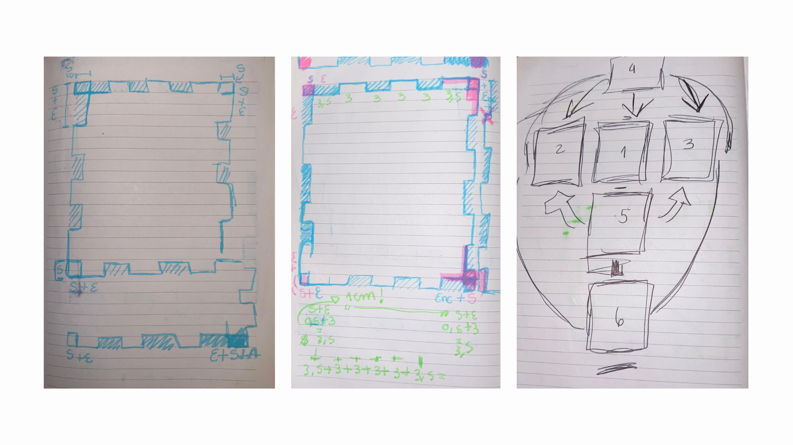
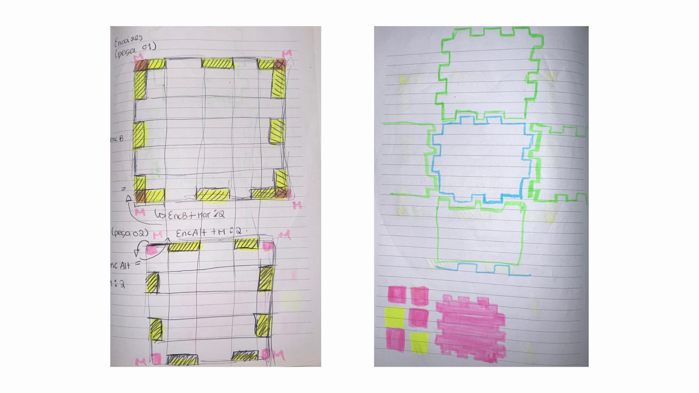
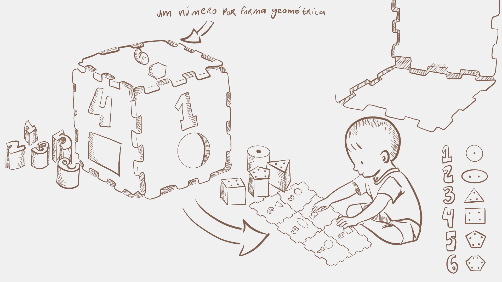
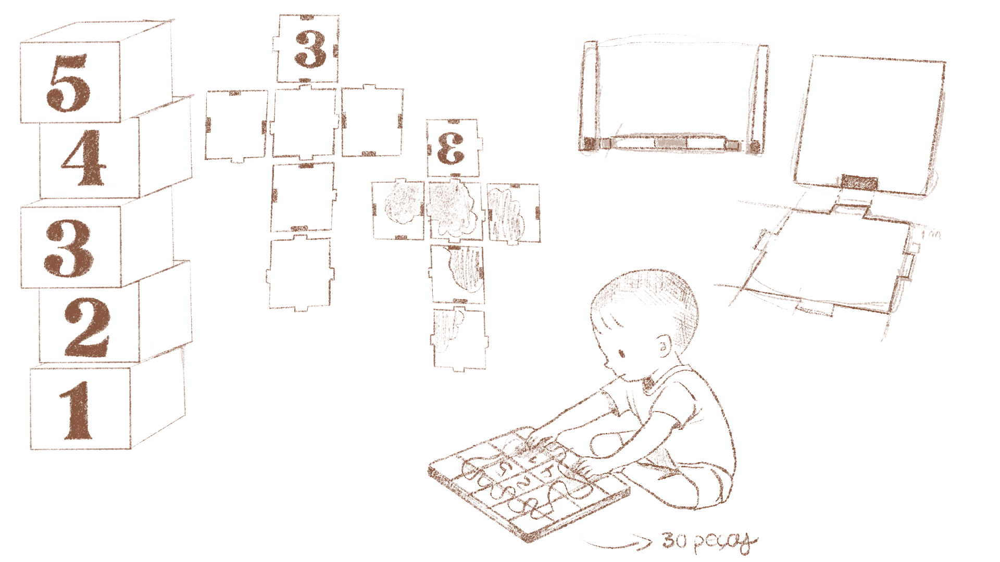
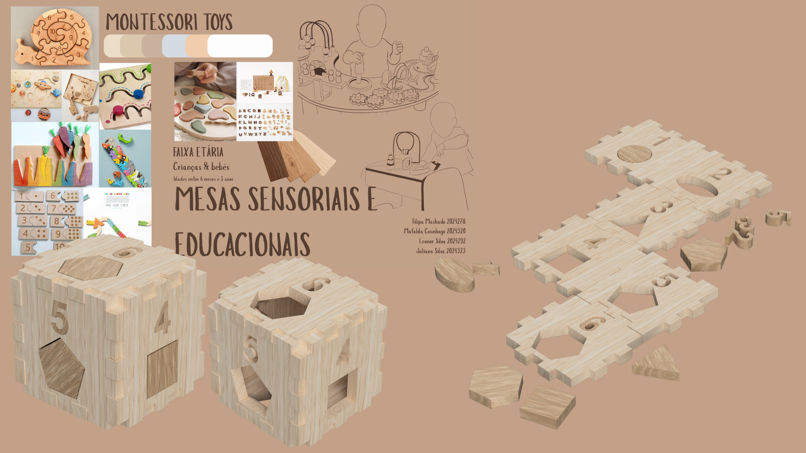
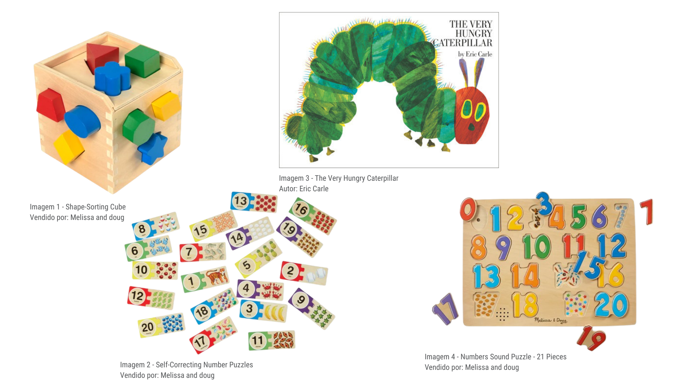

# Processo

> Organizado do **mais recente** para o **mais antigo**.

## 1. Modelos 3D

Embed do Fusion (visualização do modelo paramétrico).

https://a360.co/3PW18YH

## 2. Esboços e Pranchas-Resumo

## 2.1 Esboços

> Foram desenvolvidos vários esboços ao longo do projeto com o objetivo de explorar diferentes soluções formais e funcionais. Em todas as propostas, a minha principal preocupação esteve relacionada com os sistemas de encaixe e com a forma como as peças se relacionavam entre si durante a montagem e utilização do brinquedo. Através destes estudos foi possível testar diferentes abordagens, identificar limitações e aperfeiçoar progressivamente o conceito, culminando na solução final apresentada.

## 2.2 Pranchas-Resumo

As pranchas resumo constituíram uma ferramenta fundamental ao longo do desenvolvimento do projeto, permitindo sintetizar ideias, testar soluções e registar as diferentes fases de evolução do brinquedo. Desenvolvidas integralmente em formato digital, estas pranchas reuniram informação relativa ao conceito, à função, aos materiais e às estratégias construtivas, acompanhando as sucessivas reformulações do projeto até à definição da proposta final.

> **Prancha resumo final** - Esta versão consolida as principais decisões tomadas ao longo do processo de desenvolvimento, traduzindo a solução definitiva do projeto. A partir desta proposta foram definidos os aspetos técnicos e funcionais necessários à modelação tridimensional e à concretização do brinquedo.

> **Segunda proposta de desenvolvimento** - Nesta fase foram introduzidas alterações significativas relativamente à solução inicial, procurando simplificar a estrutura do brinquedo e otimizar a utilização dos materiais. Apesar dos progressos alcançados, verifiquei que a dinâmica da brincadeira permanecia demasiado limitada, conduzindo à necessidade de enriquecer a experiência de utilização e reforçar o potencial educativo do objeto.

> **Primeira proposta conceptual** - Em resposta ao tema proposto para o projeto, foi inicialmente considerada a utilização de restos de madeira provenientes de grandes indústrias. No entanto, após uma análise mais aprofundada, concluiu-se que a quantidade de material necessária à produção do brinquedo tornava esta solução pouco coerente com a premissa de valorização dos excedentes. Esta constatação levou à reformulação da proposta e à exploração de novas possibilidades de desenvolvimento.

## 3. Pesquisa

### 3.1. Aspectos valorizados do moodboard, desconstrução da forma (o que distingue o programa formal)

> As referências selecionadas do moodboard evidenciam uma linguagem visual assente na madeira, em geometrias simples e em experiências de aprendizagem concretas. A desconstrução destes elementos permitiu identificar princípios comuns, como a modularidade, a manipulação ativa e a associação entre brincar e aprender. No desenvolvimento deste projeto, estes aspetos foram reinterpretados através de um sistema de encaixe que transforma números e formas geométricas numa experiência tridimensional de descoberta.

### 3.2. Objetos de referencia

Inventário de precedentes, brinquedos análogos, referências históricas.

>  **(Imagem 1) – Shape-Sorting Cube** - Sistemas de encaixe entre formas geométricas, inspirou a associação entre cada peça e o respetivo espaço, promovendo o reconhecimento das formas, a coordenação motora fina e a resolução de problemas através da experimentação.
>  **(Imagem 2) – Self-Correcting Number Puzzles** - Autocorreção como estratégia de aprendizagem, inspirou a criação de desafios onde a própria criança consegue identificar os erros e encontrar soluções de forma autónoma, respeitando o seu ritmo de descoberta.
>  **(Imagem 3) – The Very Hungry Caterpillar** - Introdução de conceitos matemáticos básicos através da narrativa e da repetição, reforçou a ideia de que a aprendizagem dos números pode acontecer de forma lúdica, intuitiva e integrada na experiência da brincadeira.
>  **(Imagem 4) – Numbers Sound Puzzle** - Aprendizagem dos números através da manipulação direta, influenciou a introdução dos algarismos no Nestor, permitindo estabelecer relações entre símbolos, quantidades e a exploração tátil das peças.

## 4. Outros Elementos

As versões intermédias desenvolvidas no Autodesk Fusion 360 permitiram explorar diferentes sistemas de encaixe e testar o comportamento das peças durante a montagem do brinquedo. Estes modelos funcionaram como ferramentas de experimentação e validação, possibilitando a identificação de problemas e o aperfeiçoamento progressivo da solução até à definição da proposta final.

**tentativa 1**
https://a360.co/4gs6mWL 

**tentativa 2**
https://a360.co/3S6xn8e 
