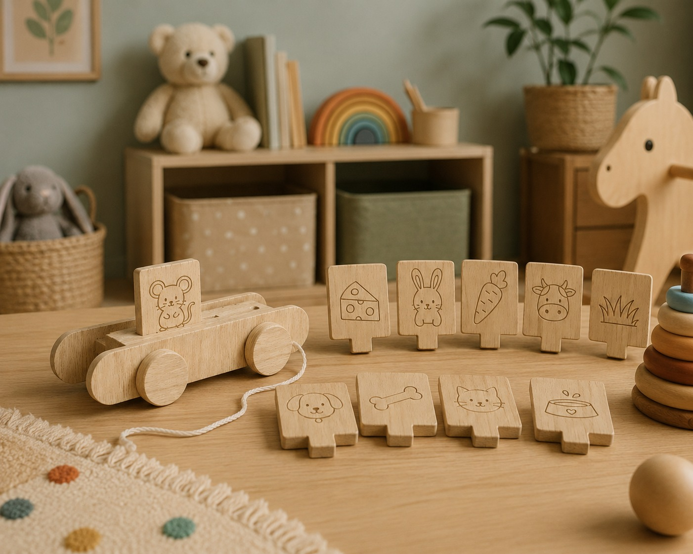
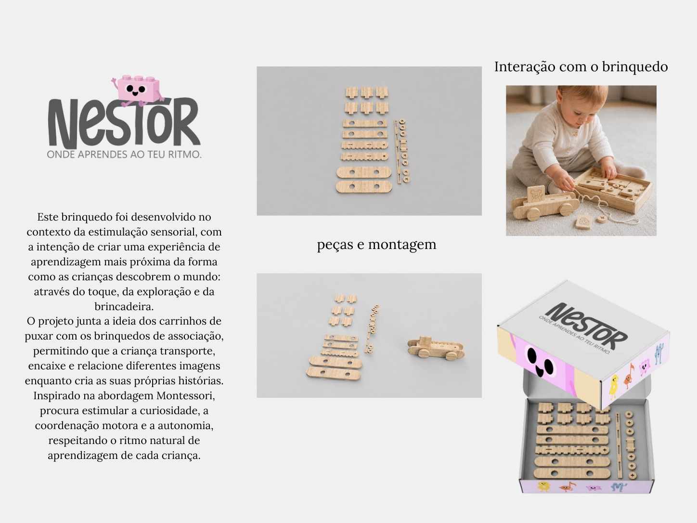

# Ninho da Família

<!--
  HERO: idealmente uma pseudo-sessão fotográfica do produto
  (ver tutorial Pletor.ai nos Recursos da disciplina, em
  /Recursos/AI_exps/). Usa attachments/hero.jpg para o frontmatter.
-->

> Texturas que despertam a descoberta.

## Conceito

Este projeto consiste num brinquedo educativo em madeira que combina associação de imagens, encaixe e movimento num único objeto. Através de um sistema de peças ilustradas e de um carrinho de puxar, a criança é instruida a relacionar diferentes elementos e a criar pequenas narrativas através da brincadeira.
Destina-se a crianças em idade pré-escolar, numa fase em que o desenvolvimento da motricidade fina, da linguagem, da capacidade de associação e do raciocínio lógico assume um papel essencial. Inspirado nos princípios da metodologia Montessori 
( conceito geral do grupo) , o brinquedo respeita o ritmo individual de cada criança, incentivando a exploração autónoma e a descoberta através da experiência prática.
A proposta surge da intenção de transformar a aprendizagem em algo mais sensorial e interativo.

## Enquadramento

O presente projeto insere-se no contexto dos brinquedos educativos inspirados na metodologia Montessori e no desenvolvimento sensorial infantil, privilegiando a aprendizagem através da exploração, da observação e da descoberta ativa.
Durante a fase de pesquisa foram analisadas duas tipologias principais: os brinquedos de associação, que promovem relações entre imagens e conceitos, e os carrinhos de puxar, que introduzem movimento e liberdade de exploração. Estas referências serviram de base ao desenvolvimento do projeto, sendo reinterpretadas numa proposta única que combina deslocação, encaixe e associação.
O resultado foi o desenvolvimento do Ninho das Famílias, procurando criar uma experiência lúdica onde a criança transporta, organiza e relaciona diferentes elementos enquanto constrói significados através da brincadeira.

Posicionamento em relação ao contexto de grupo (ver [contexto](../../contexto.md)) e à recolha de objetos a redesenhar.

## Tecnologia

O brinquedo foi concebido em madeira de carvalho, material selecionado pela sua aparência natural. A escolha de uma madeira clara pretende reforçar a componente sensorial do objeto e transmitir uma linguagem visual simples.
A estrutura do carrinho e das peças foi desenvolvida através de um sistema de encaixe mecânico, permitindo montagem e desmontagem sem recurso a elementos adicionais. As ilustrações foram desenhadas com linhas simples gravadas na superfície das peças, facilitando a leitura visual.
Todas as peças foram modeladas digitalmente no Fusion 360. O processo permitiu gerar os ficheiros técnicos necessários para um potencial fabrico através de corte CNC em madeira.

- Modelo 3D: 
  https://a360.co/4a3eol8

## Função

O brinquedo possui uma função educativa e sensorial, promovendo o desenvolvimento da coordenação motora fina, da associação visual, da criatividade, da perceção espacial e da construção narrativa.
A utilização combina diferentes formas de interação, aumentando as possibilidades de descoberta e incentivando a criança a explorar ao seu próprio ritmo.

###  Como se brinca?

**Associação** – A criança observa as imagens presentes nas peças e procura relacionar cada elemento com a sua respetiva família ou contexto, criando ligações e compreendendo relações entre objetos e personagens.

**Encaixe e transporte** – As peças podem ser colocadas e reorganizadas no carrinho, permitindo transportar o brinquedo e criar diferentes sequências e histórias durante a brincadeira.

**Exploração livre** – Não existe apenas uma solução correta; o brinquedo incentiva a experimentação, a imaginação e a construção de novas formas de brincar.
O brinquedo destina-se a crianças com idade igual ou superior a 3 anos.

## Apresentação

Brinquedo educativo · Estimulação sensorial · Montessori · Associação de imagens · Encaixe · Coordenação motora · Narrativa infantil ·

---

## Processo

O percurso completo de iterações, modelos e pesquisa está em [processo.md](processo.md), organizado do **mais recente** para o **mais antigo**.

[Ver processo completo →](processo.md)
