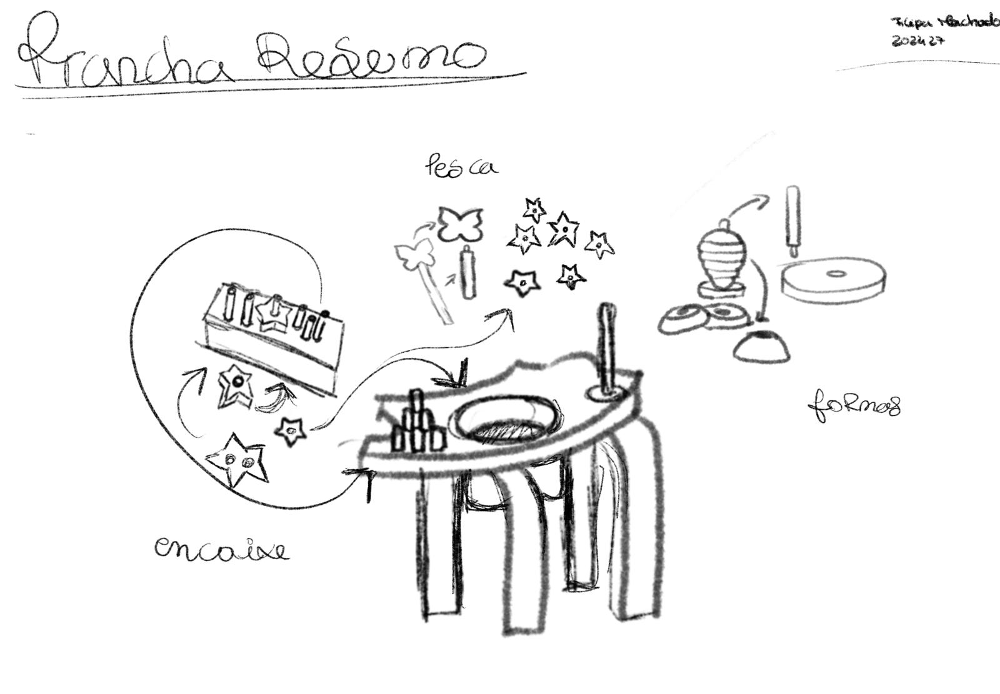
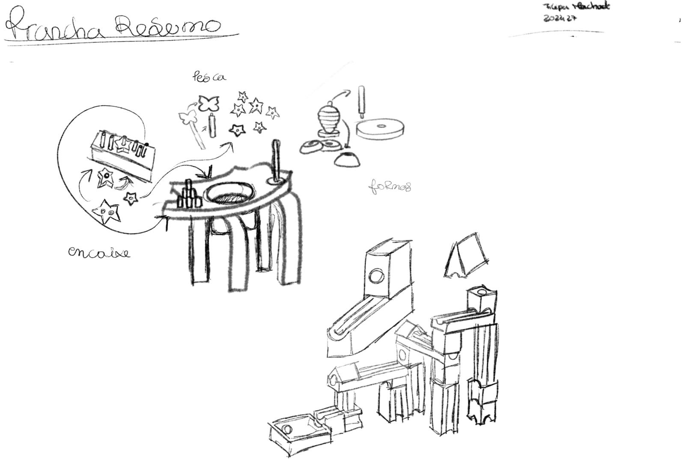
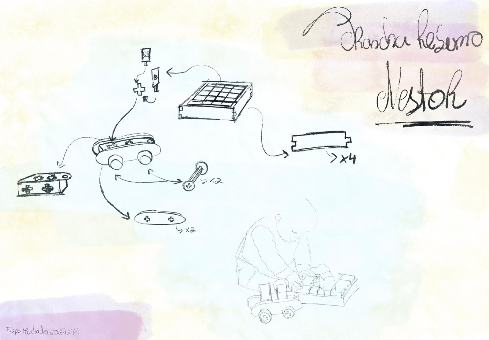
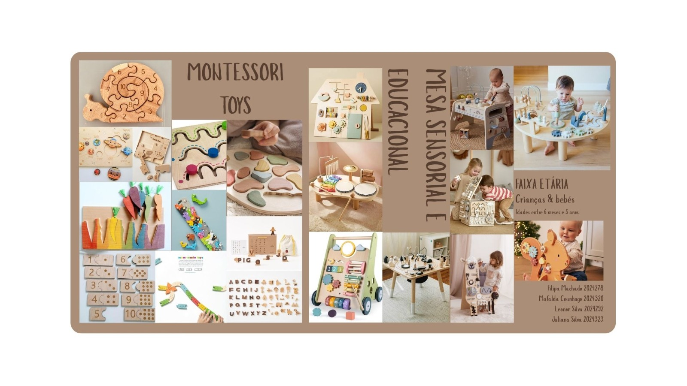
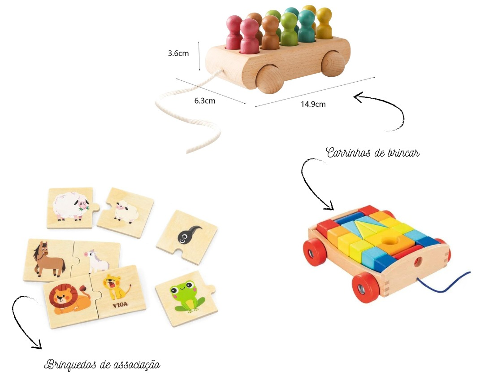

# Processo

> Organizado do **mais recente** para o **mais antigo**. 

## 1. Modelos 3D

Embed do Fusion (visualização do modelo paramétrico).

https://a360.co/4a3eol8

## 2. Esboços e Pranchas-Resumo

###  2.1 Esboços e Testes

Durante o processo de desenvolvimento foram exploradas diferentes ideias, formas de interação e possibilidades construtivas através de esboços e testes conceptuais. Esta fase permitiu experimentar abordagens diferentes, contribuindo para uma melhor compreensão do objeto e para a definição da proposta final. Embora estas soluções não tenham sido desenvolvidas até ao produto final, tiveram um papel importante na evolução do conceito e na construção do Ninho das Famílias.

### 2.2 Prancha-Resumo

> Esta prancha-resumo funcionou como um instrumento de síntese e consolidação do processo de desenvolvimento do projeto, reunindo de forma visual as principais decisões construtivas e funcionais do brinquedo. Através de esquissos e representações gráficas, foram exploradas as relações entre os diferentes componentes, os sistemas de montagem e as possibilidades de interação e configuração. A prancha permitiu documentar a evolução das soluções adotadas, desde a definição das peças modulares até à organização estrutural do objeto final, tornando visível o percurso de experimentação e refinamento que conduziu à proposta desenvolvida.

## 3. Pesquisa

### 3.1. Aspectos valorizados do moodboard, desconstrução da forma (o que distingue o programa formal)

> As referências selecionadas do moodboard evidenciam uma linguagem visual assente na madeira, em geometrias simples e em experiências de aprendizagem concretas. A desconstrução destes elementos permitiu identificar princípios comuns, como a modularidade, a manipulação ativa e a associação entre brincar e aprender. No desenvolvimento deste projeto, estes aspetos foram reinterpretados através de um sistema de encaixe que transforma números e formas geométricas numa experiência tridimensional de descoberta.

### 3.2. Objetos de referencia

Inventário de precedentes, brinquedos análogos, referências históricas.

>  Para desenvolver o Ninho da Família, inspirei-me em dois tipos de brinquedos: os brinquedos de associação, que incentivam as crianças a relacionar imagens e descobrir ligações, e os carrinhos de puxar, que introduzem movimento e uma forma mais livre de explorar o brinquedo. Ao juntar estes dois conceitos, quis criar uma experiência onde as crianças pudessem transportar, encaixar e criar pequenas histórias, associando cada elemento à sua respetiva família. Esta ideia aproxima-se da abordagem Montessori, promovendo a aprendizagem através da descoberta, da autonomia e do brincar.
