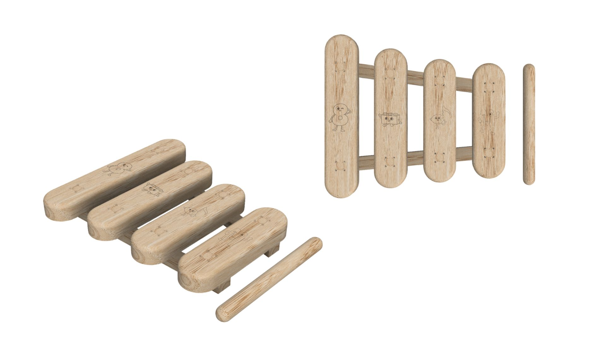
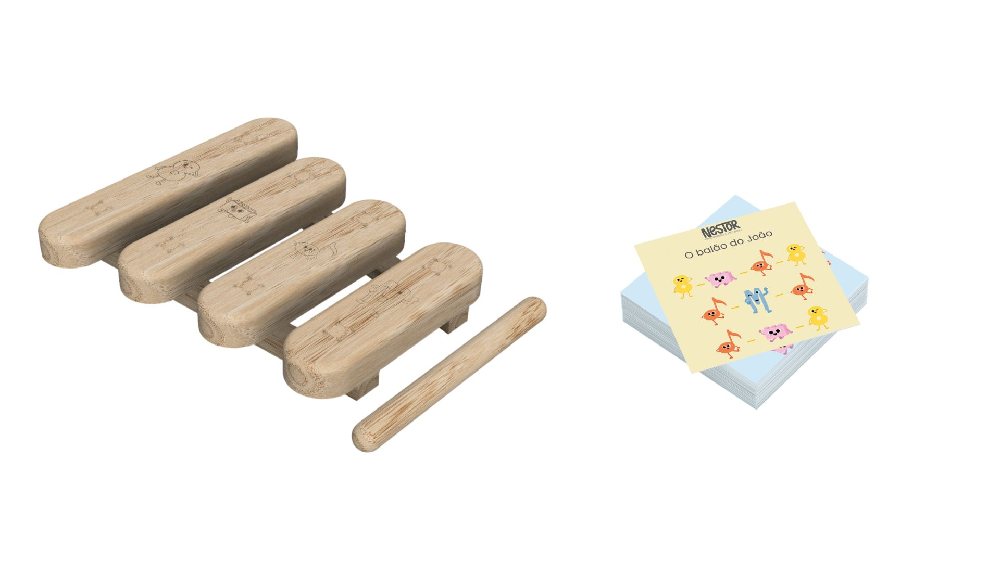
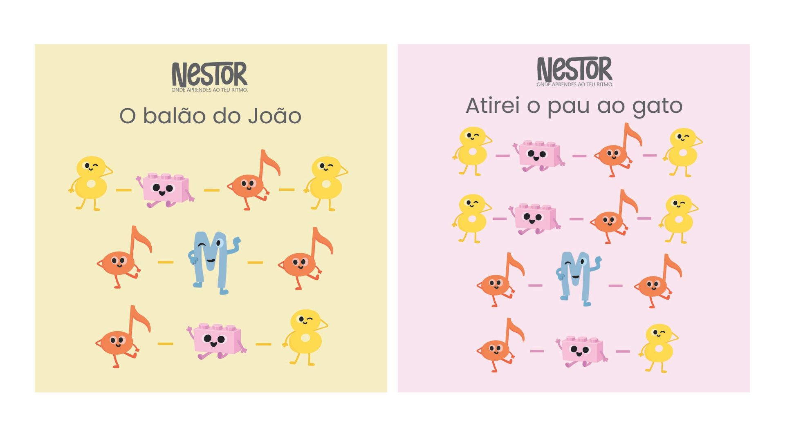

# Xilofone Aprende e Toca

<!--
  HERO: idealmente uma pseudo-sessão fotográfica do produto
  (ver tutorial Pletor.ai nos Recursos da disciplina, em
  /Recursos/AI_exps/). Usa attachments/hero.jpg para o frontmatter.
-->

> Cada carta, uma ideia. Cada nota, uma nova criação.

## Conceito

O meu projeto consiste num xilofone educativo para crianças, desenvolvido com base nos princípios pedagógicos de Maria Montessori. O objetivo principal é proporcionar uma experiência de aprendizagem que combine música, exploração sensorial, desenvolvimento motor e autonomia.
O instrumento é composto por quatro barras musicais, o dó, mi, sol e o lá, os quais estão organizados para produzir sons distintos e agradáveis. A escolha de um número reduzido de notas torna a utilização mais simples e intuitiva, permitindo que as crianças mais novas consigam criar pequenas melodias com sucesso.
Além da componente musical, o projeto integra um jogo educativo, transformando o xilofone numa ferramenta de aprendizagem interativa. Através de uma sequência de elementos e associação dos mesmos, incentiva as crianças a desenvolver competências cognitivas como a memória, atenção e a concentração. O jogo permite que a aprendizagem aconteça de forma lúdica, respeitando o ritmo individual de cada criança.
Este projeto procura unir a música, brincadeira e a educação num só objeto, promovendo o desenvolvimento global da criança. Mais do que um simples instrumento musical, o xilofone é uma ferramenta pedagógica que estimula a criatividade, a autonomia, coordenação motora e a descoberta ativa.

## Enquadramento

O desenvolvimento deste projeto enquadra-se na área da educação infantil e da aprendizagem através da exploração sensorial, tendo como principal referência a abordagem pedagógica de Maria Montessori. A escolha desta metodologia surge da sua relevância no contexto do desenvolvimento da criança, defendendo uma aprendizagem ativa, autónoma e centrada nos interesses e capacidades de cada indivíduo.
Maria Montessori acreditava que as crianças aprendem melhor quando têm a oportunidade de explorar algo de uma forma livre e através dos seus próprios sentidos.
Na sua abordagem, os materiais educativos desempenham um papel fundamental, devendo ser simples, intuitivos e capazes de estimular a curiosidade, a concentração e a descoberta. O contacto direto com objetos concretos permite à criança construir conhecimento através da experiência, em vez de apenas receber informação de forma passiva.
Neste contexto, o xilofone educativo desenvolvido insere-se na valorização dos materiais manipuláveis e da liberdade de criação de sinfonias. A interação com o instrumento permite que a criança explore diferentes sons, estabeleça relações entre ações e resultados, e que desenvolva capacidades motoras e cognitivas através da experimentação. A música sempre foi e é uma grande ferramenta de aprendizagem, promovendo a criatividade, expressão de cada criança e a coordenação motora.
A relação deste projeto com o trabalho desenvolvido pelo restante grupo encontra-se na partilha dos mesmos princípios pedagógicos e educativos. Tal como os restantes elementos, este projeto procura criar uma experiência que promova a autonomia, o desenvolvimento sensorial e a aprendizagem através da interação prática com os materiais. Desta forma, o xilofone não é apenas um instrumento musical, mas também um recurso educativo que contribui para um ambiente de aprendizagem inspirado na visão de Maria Montessori, onde a criança assume um papel ativo na construção do seu conhecimento.

## Tecnologia

O xilofone foi concebido em madeira de carvalho, o mesmo selecionado pela sua elevada resistência, durabilidade e qualidade estética. A escolha deste material permite obter uma estrutura robusta e adequada à utilização por crianças. 
A estrutura principal foi desenvolvida a partir de 4 barras, cada uma têm uma escavação/profundidade diferente para produzirem sons diferentes, quanto mais escavado for mais grave o som fica e quanto menos escavado for mais agudo fica o som. Todas elas com 2 cm de espessura, o Dó com 20 cm de comprimento e 6-8 cm de escavação; Mi com 17,7 cm de comprimento e 5-6 de escavação; Sol com 15,8 cm de comprimento e 4-5 de escavação; Lá com 14,9 cm de comprimento e 3-5 de escavação.
O desenvolvimento técnico foi realizado no Autodesk Fusion 360, recorrendo à modelação paramétrica para definir as geometrias, ajustar medidas e simular a montagem do produto.
Relativamente aos processos de fabrico, as peças estruturais seriam produzidas através de corte CNC, garantindo precisão dimensional. 
Nos encaixes foi aplicada a técnica dos dog bones, uma solução que permite obter uniões mais precisas entre diferentes peças, facilitando a montagem do xilofone e aumentando a estabilidade da estrutura. A gravação dos elementos poderia ser realizada através de laser, um processo que permite obter desenhos e símbolos com elevada precisão sem comprometer a resistência ou sonoridade das barras.

- Modelo 3D: [https://a360.co/4eDZBPl](https://a360.co/4eDZBPl)

## Função

O xilofone educativo foi desenvolvido com o objetivo de promover a aprendizagem através da música. A sua principal função é estimular o desenvolvimento da coordenação motora, da percepção auditiva, da criatividade e autonomia da criança, permitindo que esta aprenda através da experimentação e descoberta.
A utilização do produto é simples e intuitiva, a criança pode tocar nas diferentes barras com a baqueta para produzir sons distintos e explorar livremente as combinações possíveis. Para além da componente musical, o xilofone integra um jogo educativo que desafia a criança a reproduzir sequências, padrões e associar elementos visuais às notas correspondentes.
O produto foi concebido para crianças em idade pré-escolar e nos primeiros anos do ensino básico, sendo particularmente entre os 3 aos 6 anos.
Nesta fase de desenvolvimento, as crianças encontram-se numa etapa de grane evolução das capacidades motoras, cognitivas e sensoriais.
Relativamente à montagem, foi projeto para possuir uma estrutura simples e robusta. Os diferentes componentes são unidos através de dog bones, que permitiu me garantir uma montagem precisa e estável, facilitando a união das peças e assegurando a resistência da estrutura.
No que diz respeito à segurança, o projeto foi desenvolvido tendo em consideração os princípios definidos pela Diretiva 2009/48/CE, relativa à segurança dos brinquedos. Esta diretiva estabelece os requisitos iniciais que os brinquedos devem cumprir para garantir a proteção da saúde e da segurança das crianças durante a sua utilização normal ou previsível.
Neste sentido, o xilofone apresenta superfícies lisas e devidamente acabadas, minimizando o risco de cortes, lascas ou ferimentos. Os materiais utilizados são adequados ao contacto frequente por crianças e a estrutura foi concebida para assegurar a estabilidade durante a utilização. 
Desta forma, o produto procura responder não apenas aos objetivos educativos e lúdicos definidos no projeto, mas também aos requisitos de segurança e qualidade esperados para um brinquedo destinado ao público infantil, garantindo uma experiência de utilização segura, estimulante e adequada ao seu contexto pedagógico.
## Apresentação

---

## Processo

O percurso completo de iterações, modelos e pesquisa está em [processo.md](processo.md), organizado do **mais recente** para o **mais antigo**.

[Ver processo completo →](processo.md)
