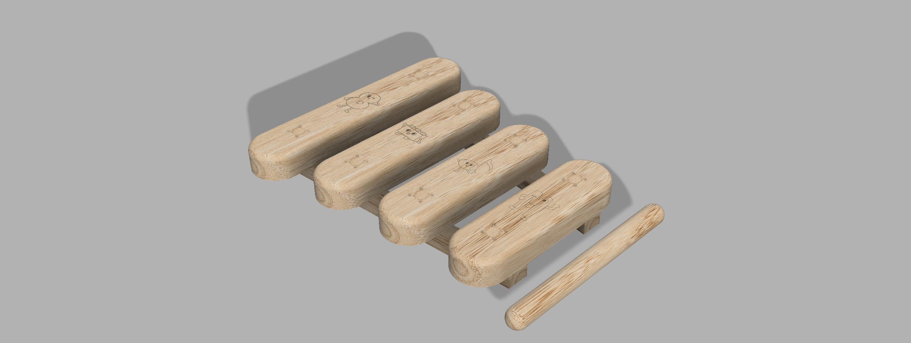

# Xilofone Aprende e Toca

<!--
  HERO: idealmente uma pseudo-sessão fotográfica do produto
  (ver tutorial Pletor.ai nos Recursos da disciplina, em
  /Recursos/AI_exps/). Usa attachments/hero.jpg para o frontmatter.
-->

> Cada carta, uma ideia. Cada nota, uma nova criação.

## Conceito

O meu projeto consiste num xilofone educativo para crianças, desenvolvido com base nos princípios pedagógicos de Maria Montessori. O objetivo principal é proporcionar uma experiência de aprendizagem que combine música, exploração sensorial, desenvolvimento motor e autonomia.
O instrumento é composto por quatro barras musicais, o dó, mi, sol e o lá, os quais estão organizados para produzir sons distintos e agradáveis. A escolha de um número reduzido de notas torna a utilização mais simples e intuitiva, permitindo que as crianças mais novas consigam criar pequenas melodias com sucesso.
Além da componente musical, o projeto integra um jogo educativo, transformando o xilofone numa ferramenta de aprendizagem interativa. Através de uma sequência de elementos e associação dos mesmos, incentiva as crianças a desenvolver competências cognitivas como a memória, atenção e a concentração. O jogo permite que a aprendizagem aconteça de forma lúdica, respeitando o ritmo individual de cada criança.
Este projeto procura unir a música, brincadeira e a educação num só objeto, promovendo o desenvolvimento global da criança. Mais do que um simples instrumento musical, o xilofone é uma ferramenta pedagógica que estimula a criatividade, a autonomia, coordenação motora e a descoberta ativa.

## Enquadramento

O desenvolvimento deste projeto enquadra-se na área da educação infantil e da aprendizagem através da exploração sensorial, tendo como principal referência a abordagem pedagógica de Maria Montessori. A escolha desta metodologia surge da sua relevância no contexto do desenvolvimento da criança, defendendo uma aprendizagem ativa, autónoma e centrada nos interesses e capacidades de cada indivíduo.
Maria Montessori acreditava que as crianças aprendem melhor quando têm a oportunidade de explorar algo de uma forma livre

## Tecnologia

Materiais (espécie de madeira), processos de fabrico (CNC, laser, impressão 3D), software paramétrico, ficheiros técnicos.

- Modelo 3D: <!-- embed Fusion ou link a360.co -->
- Ficheiros: `attachments/`

## Função

Como se brinca, idade-alvo, montagem, conformidade com a Diretiva 2009/48/CE.

## Apresentação

Imagens-chave que sintetizam o produto final.

---

## Processo

O percurso completo de iterações, modelos e pesquisa está em [processo.md](processo.md), organizado do **mais recente** para o **mais antigo**.

[Ver processo completo →](processo.md)
