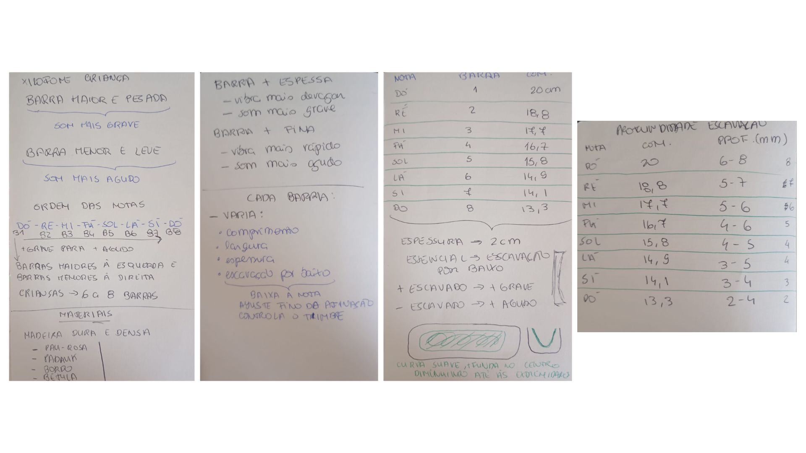

# Processo

> Organizado do **mais recente** para o **mais antigo**. Faz uma seleção que torne clara, aprazível e detalhada a evolução do produto e das ideias.

## 1. Modelos 3D

 [https://a360.co/4eDZBPl]

## 2. Esboços e Pranchas-Resumo

%201.jpeg)
.jpeg)

Foram realizados diferentes esboços, de forma a entender as formas e qual seria mais segura para a utilização das crianças, foi também pensado e desenhado dois tipos de bases a qual eu optei por utilizar a base da segunda imagem pois se optasse por uma base completa iria abafar o som produzido pelas barras do xilofone.

Realizei ainda testes no fusion das bases e confirmei que a base completa nunca iria funcionar e experimentei diferentes formas de barra e passei por três testes, a barra retangular sem cantos redondos que não seria uma boa opção por segurança e a base escolhida foi a barra com as extremidades todas redondas pois tal como é mais seguro, esteticamente fica mais agradável ao olhar.
## 3. Maquete

Maquete realizada em cartão para testar/definir medidas.

## 4. Pesquisa

### 4.1. Aspectos valorizados do moodboard, desconstrução da forma (o que distingue o programa formal)

### 4.2. Objetos de referencia

Inventário de precedentes, brinquedos análogos, referências históricas.

