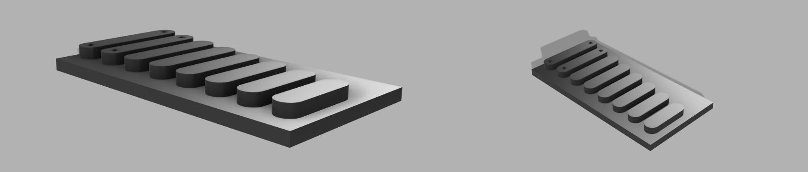
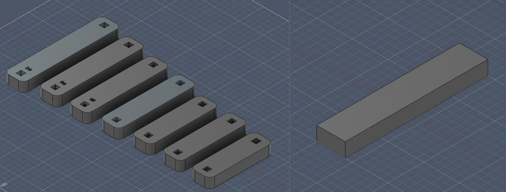
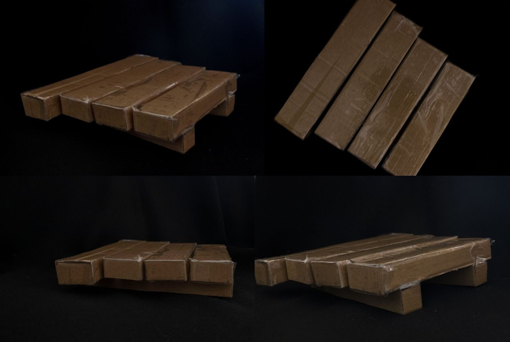
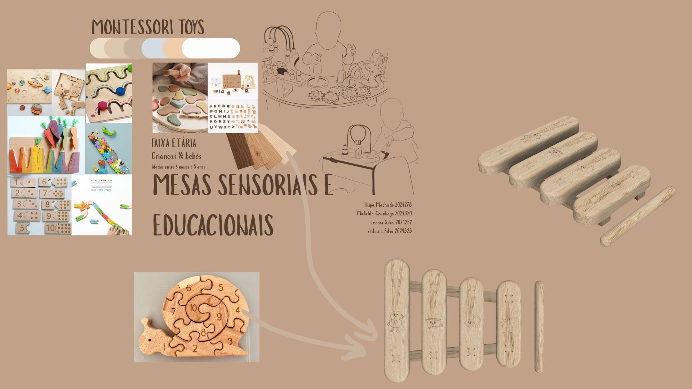

# Processo

> Organizado do **mais recente** para o **mais antigo**. 

## 1. Modelos 3D

 [https://a360.co/4eDZBPl]

## 2. Esboços e Pranchas-Resumo

.jpeg)
.jpeg)

Foram realizados diferentes esboços, de forma a entender as formas e qual seria mais segura para a utilização das crianças, foi também pensado e desenhado dois tipos de bases a qual eu optei por utilizar a base da segunda imagem pois se optasse por uma base completa iria abafar o som produzido pelas barras do xilofone.

Realizei ainda testes no fusion das bases e confirmei que a base completa nunca iria funcionar e experimentei diferentes formas de barra e passei por três testes, a barra retangular sem cantos redondos que não seria uma boa opção por segurança e a base escolhida foi a barra com as extremidades todas redondas pois torna-se mais seguro e esteticamente fica mais agradável e adequado aos brinquedos de crianças.
## 3. Maquete

Maquete realizada em cartão para testar/definir medidas.

## 4. Pesquisa

### 4.1. Aspectos valorizados do moodboard, desconstrução da forma (o que distingue o programa formal)

No moodboard foram retiradas algumas referências para o início da construção do meu produto, foram retirados elementos como a cor da madeira de carvalho bem como a gravação de números, símbolos e pequenas ilustrações. Estes elementos foram integrados no xilofone de forma a combinar a componente musical com a componente lúdica.
### 4.2. Objetos de referencia

Inventário de precedentes, brinquedos análogos, referências históricas.

As imagens apresentadas serviram de referência para o desenvolvimento do xilofone. Entre todas as referências analisadas, a que exerceu maior influência foi o Xilofone Musical Infantil, não apenas pela sua estética, mas também pelas formas adotadas nas barras sonoras e na estrutura de suporte inferior, aspetos que foram reinterpretados e adaptados ao conceito final de projeto.
As restantes imagens constituíram referências iniciais, utilizadas durante a fase de exploração e de seleção do instrumento a desenvolver. A escolha final recaiu sobre o xilofone, por se tratar de um instrumento que estabelece uma boa ligação com a madeira, tanto pelas suas características estéticas como pelas suas propriedades acústicas, permitindo a produção de sons.